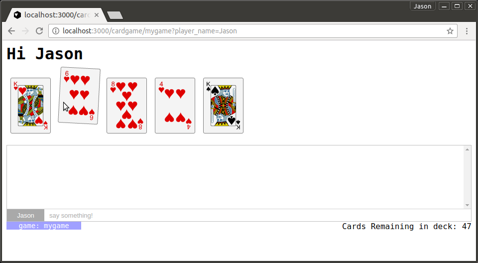
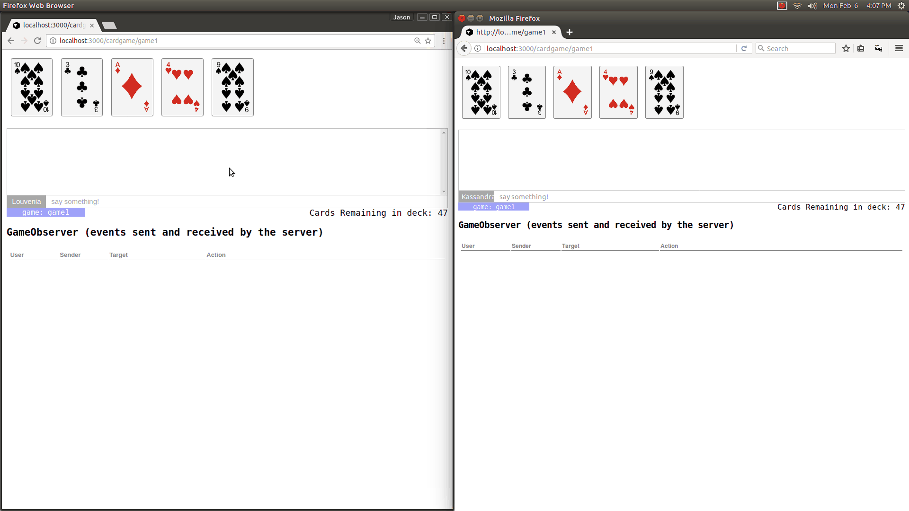

# card_game

This is a demo app for [lattice-core]() which is a framework for crystal that is still
very much in the proof-of-concept stage.  The intent is to really show how powerful
a WebSocket-first framework can be.  Kemal serves as an excellent base framework, and
crystal's ruby-like syntax with native speed brings everything together.

If you haven't spent some time investigation [crystal](crystal-lang.org), you're doing
yourself a disservice.  It is an _amazing_ language with an excellent library.

## Installation

clone this repo and run `shards install` 

## Usage

run the app with `crystal src/card_game.cr`
open a browser and go to `localhost:3000/cardgame/abc`
where `abc` becomes a new game at that address.  
Use chrome & firefox at the same url to show two different sessions accessing a game.

#Walk Through

First things first.  This demo _emulates_ a card game.  Imagine if you were playing poker
online against a few other people. Each of you is show a deck.  This is what that interface
might look like, but it's a facade intended more to show how the interaction between server
and client work.  It has a a deck of 52 cards which are drawn from randomly.  
But there's one hand, which all players see and interact with.  You can click until the deck
runs out.

That said, here's an opening page.


This is pretty straightforward.  In fact, here's the for the game, the hand, and the first
card, including some data- attributes that will be discussed in detail later...

```html
<h1>Hi Jason</h1>
<div data-version="3" data-item="cardgame-94243174726304">
  <div id="hand">
    <span class="card-holder">
      
    </span>
    ... more card holder spans
  </div>
</div>

```

Nothing fancy.  There's under 100 lines of javascript code, and no external libraries like
jQuery, lodash, underscore, etc (not that you wouldn't ulimately use those; it's just that 
they are not needed for this framework).

Take note of a few things.  The url, `/cardgame/mygame?player_name=Jason` creates a game 
called "mygame" and my player name is Jason (in a real app, you'd have authentication and the
like, but this demo set up to switch games quickly to show the meat and potatoes).

There in an in-game chat that allows player communcation, and it also shows when a player
draws a card.  Simple stuff.

So we have the stage set:  We have a "game" that can have many players, each of who interact with
a set of playing cards.   Suppose I want to change the second card, which I do by clicking the
card itself:



In the above example, I'm hovering over the six of hearts.  Now I click:


With one click, the image has changed, the number of cards remaining has decreased from 47 to 46,
and a new chat message has been entered that shows I picked the 9 of Diamonds.

Ok, sure, that's interesting.  There could be some ugly javascript doing some smoke-and-mirrors
that make things _look_ interesting.  But how is this different?

Let's try something a little more impressive, and add an animated gif while we're at it.

We're going to have Firefox on the left, Chrome on the right, both going to the same game named
`twoplayers`.  Both browsers have the development console open so you can see the updates as
they happen.

Notice that each click on a card updates the card for both players, across different browsers, 
and it does it about as close to real time as you can get.  Notice, too, that the chat window
updates with the card drawn by each user, and the Cards Remaining In Deck update as well.




- [Jason Landry](https://github.com/jasonl99) creator, maintainer
